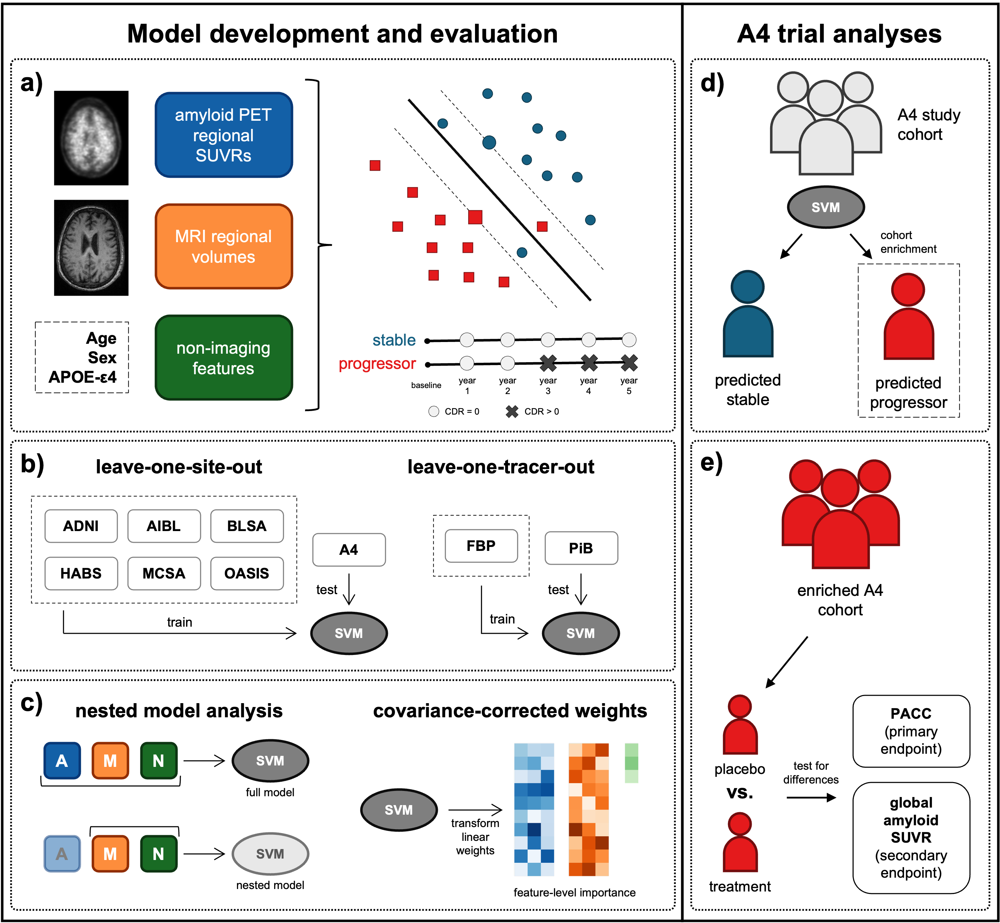

<!--- This markdown file was designed to roughly follow the Penn LINC Neuroinformatics template: https://pennlinc.github.io/docs/Contributing/ProjectTemplate/ --->

# Predicting future cognitive impairment in preclinical Alzheimer’s disease using amyloid PET and MRI: A multisite machine learning study



# Project Description

This repository contains accompanying code for the manuscript "[Predicting future cognitive impairment in preclinical Alzheimer’s disease using amyloid PET and MRI: A multisite machine learning study](https://doi.org/10.1016/j.neurobiolaging.2026.04.005)".

## Corresponding Authors

- [Braden Yang](mailto:b.y.yang@wustl.edu)
- [Aris Sotiras](mailto:aristeidis.sotiras@pennmedicine.upenn.edu)

## Coauthors

- Tom Earnest
- Murat Bilgel
- Marilyn S Albert
- Sterling C Johnson
- Christos Davatzikos
- Guray Erus
- Colin L Masters
- Susan M Resnick
- Michael I Miller
- Arnold Bakker
- John C Morris
- Tammie Benzinger
- Brian Gordon

## Datasets

- [Anti-Amyloid Treatment in Asymptomatic Alzheimer’s (A4) Study](https://www.a4studydata.org/)
- [Alzheimer's Disease Neuroimaging Initiative (ADNI)](https://adni.loni.usc.edu/)
- [Harvard Aging Brain Study (HABS)](https://habs.mgh.harvard.edu/researchers/)
- [Mayo Clinic Study of Aging (MCSA)](https://ida.loni.usc.edu/collaboration/access/appLicense.jsp)
- [Preclinical Alzheimer's Disease Consortium (PAC)](https://www.kennedykrieger.org/physiologic-metabolic-anatomic-biomarkers/research/collaborative-projects/preclinical-alzheimer-s-disease-ad-consortium)
- [Open Access Series of Imaging Studies 3 (OASIS-3)](https://sites.wustl.edu/oasisbrains/)

## Scripts

Scripts are organized into the following subdirectories:

- 0_MergeTables: scripts for tidying and merging tabular data from each dataset
- 1_SubjectSelection: scripts for identifying stable and progressor subjects to train SVM models
- 2_Preprocessing: scripts for processing raw PET into regional SUVRs and raw MRI into regional volumes
- 3_TrainTestModel: scripts for training and evaluating SVM models
- 4_FeatureImportance: scripts for computing Haufe-corrected linear SVM feature importance
- 5_A4RetrospectiveAnalysis: scripts for applying trained models on the A4 cohort in the retrospective cohort enrichment experiment
- 6_TablesAndFigures: scripts to generate figures and tables

## Cite

> Yang, B., Earnest, T., Bilgel, M., Albert, M.S., Johnson, S.C., Davatzikos, C., Erus, G., Masters, C.L., Resnick, S.M., Miller, M.I., Bakker, A., Morris, J.C., Benzinger, T.L.S., Gordon, B.A., Sotiras, A., 2026. Predicting future cognitive impairment in preclinical Alzheimer’s disease using amyloid PET and MRI: A multisite machine learning study. Neurobiology of Aging. https://doi.org/10.1016/j.neurobiolaging.2026.04.005

```
@article{yangPredictingFutureCognitive2026,
  title = {Predicting Future Cognitive Impairment in Preclinical Alzheimer's Disease Using Amyloid PET and MRI: A Multisite Machine Learning Study},
  author = {Yang, Braden and Earnest, Tom and Bilgel, Murat and Albert, Marilyn S. and Johnson, Sterling C. and Davatzikos, Christos and Erus, Guray and Masters, Colin L. and Resnick, Susan M. and Miller, Michael I. and Bakker, Arnold and Morris, John C. and Benzinger, Tammie L. S. and Gordon, Brian A. and Sotiras, Aristeidis},
  year = 2026,
  month = apr,
  journal = {Neurobiology of Aging},
  issn = {0197-4580},
  doi = {10.1016/j.neurobiolaging.2026.04.005},
  urldate = {2026-04-22},
  keywords = {amyloid positron emission tomography,clinical trial cohort enrichment,machine learning,patient stratification,preclinical Alzheimer's disease,structural magnetic resonance imaging,support vector machine}
}
```